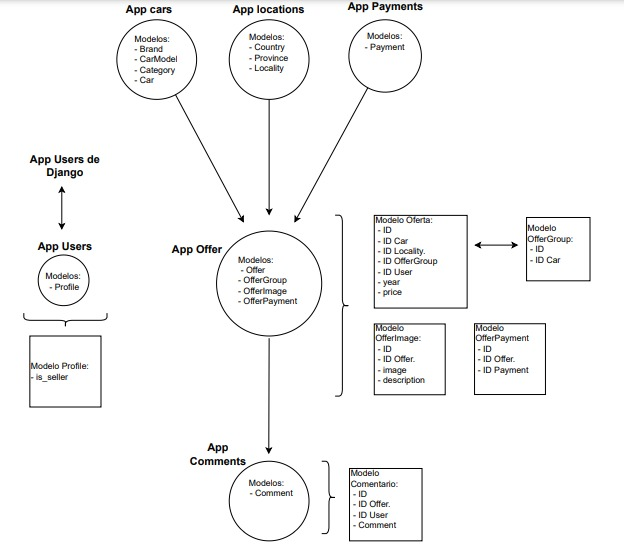

# Evaluación Final Integradora 2024 - Parte I y II.

Ingeniería de Software | ITEC Río Cuarto.

Objetivo: Desarrrollar un sistema web para compra venta de autos utilizando Django.

## Tabla de contenidos
- [Fundamento del programa](#fundamento-del-programa)
- [Tipo de usuarios](#tipos-de-usuarios)
- [Desarrollo grafico](#desarrollo-grafico)
- [Entorno Virtual e Inicio Local](#entorno-virtual-e-inicio-local)
- [Carga de datos](#carga-de-datos)
- [Documentacion API](#documentacion-api)
- [Integrantes](#integrantes)

## *Fundamento del programa*
***

El programa busca generar un sitio donde usuarios pueden actuar como vendedores y compradores de automoviles. La marca distintiva esta en nuclear las ofertas de los automoviles que los vendedores hagan según la marca y modelo del mismo permitiendo que los compradores comparen las opciones ofrecidas para una marca y modelo determinado teniendo en cuenta la pretension economica del vendedor, la localidad donde este se encuentra y el año de fabricacion del auto.

Ademas los distintos usuarios del sitio podran interactuar entre ellos dentro de una oferta determinada mediante una caja de comentarios.

## *Tipos de Usuarios*
***
***1) USUARIO ADMINISTRADOR:***

Funcionalidades:
* Cargar marcas de vehiculos.
* Cargar modelos de vehiculos.
* Cargar categorias de vehiculos.
* Generar en base a lo anterior el vehiculo que usará el usuario vendedor para generar su oferta.
* Cargar paises y provincias
* Cargar localidades en base a lo anterior que usará el usuario vendedor para generar su oferta.
* Cargar tipo de financiaciones que usará el usuario vendedor para generar su oferta.
* Eliminar comentarios de cualquier usuario.

***2) USUARIO VENDEDOR:***

Funcionalidades:
* Crear oferta para un vehiculo determinado detallando: Marca, modelo, precio, año de fabricacion.
* Seleccionar opciones de pago aceptadas para la oferta creada.
* Cargar imagenes del vehiculo ofrecido.
* Realizar comentarios a la oferta propia y a ofertas de terceros.
* Editar comentarios propios.
* Eliminar comentarios propios.
* Editar oferta realizada.
* Eliminar oferta realizada.

***3) USUARIO COMPRADOR:***

Funcionalidades:
* Hacer comentarios a ofertas.
* Editar comentarios propios.
* Eliminar comentarios propios.
* Ralizar compra de un vehiculo determinado.

***4) USUARIO NO LOGUEADO:***

Funcionalidades:
* Visualizar ofertas creadas por usuarios logueados.
* Visualizar comentarios realizados por usuarios logueados.
* Registrarse en la pagina cargando sus datos y seleccionando si desean hacerlo como usuario vendedor o no.

## *Desarrollo grafico*
***


## *Entorno Virtual e Inicio Local*
***
**Paso 1.**

Crear entorno virtual de python:

* Linux

```
python3 -m venv venv
```


El segundo *venv* es el nombre del entorno (Se puede poner otro nombre).

**Paso 2.**

Activar entorno virtual.

* Linux
```
source venv/bin/activate
```


**Paso 3.**

Dentro del entorno, levantar el archivo requirements.txt que contiene las dependencias necesarias para poder trabajar.

```
pip install -r requirements.txt
```

**Paso 4.**

Ingresar a la carpeta "dealership" y generar migraciones ejecutando los siguientes comandos:

```
python3 manage.py makemigrations
```
```
python3 manage.py migrate
```

**Paso 5.**

Generar superusuario a los fines de usar las funciones de usuario administrador.

```
python3 manage.py createsuperuser --username (nombre elegido)
```
Luego de esto seguir los pasos indicados para contraseña y correo electronico.

**Paso 6.**

Iniciar proyecto
```
python3 manage.py runserver
```

## *Carga de datos*
***
Para verificar la funcionalidad del programa se sugiere el siguiente orden de uso:

*Usando las credeciales de administrador creadas en punto 5 de item anterior:*

- Registrar dos marcas de automoviles.
- Registrar dos modelos de automoviles.
- Registrar dos categorias de automoviles.
- Crear dos automoviles.
- Registrar un pais y una provincia.
- Registrar dos localidades.
- Registar tres medios de pago.

*Usando las credenciales del primer vendedor.*
- Crear dos ofertas, una para cada automovil de los creados por el administrador.
- Realizar un comentario en una publicacion propia, editarlo y luego eliminarlo.

*Usando las credenciales del segundo vendedor.*
- Crear una oferta para uno de los vehiculos que sea coincidente con una de las realizadas por el primer vendedor.
- Realizar un comentario en una oferta creada por el primer vendedor.

*Nuevamente usando las credenciales del primer vendedor.*
- Eliminar una de las ofertas creadas.

*Usando las credenciales del comprador.*
- Crear un comentario para la oferta restante.

*Nuevamente usando las credenciales del administrador.*
- Eliminar un comentario en la oferta restante

## *Documentacion API*

Para endpoints de segunda parte de EFI, ingresar con proyecto corriendo a:

<http://localhost:8000/swagger/>


## *Integrantes*
***

* Irazoqui, Marcos - m.irazoqui@itecriocuarto.org.ar
* Martinez, Joaquin - jo.martinez@itecriocuarto.org.ar
* Tobares, Juan Cruz - j.tobares@itecriocuarto.org.ar


